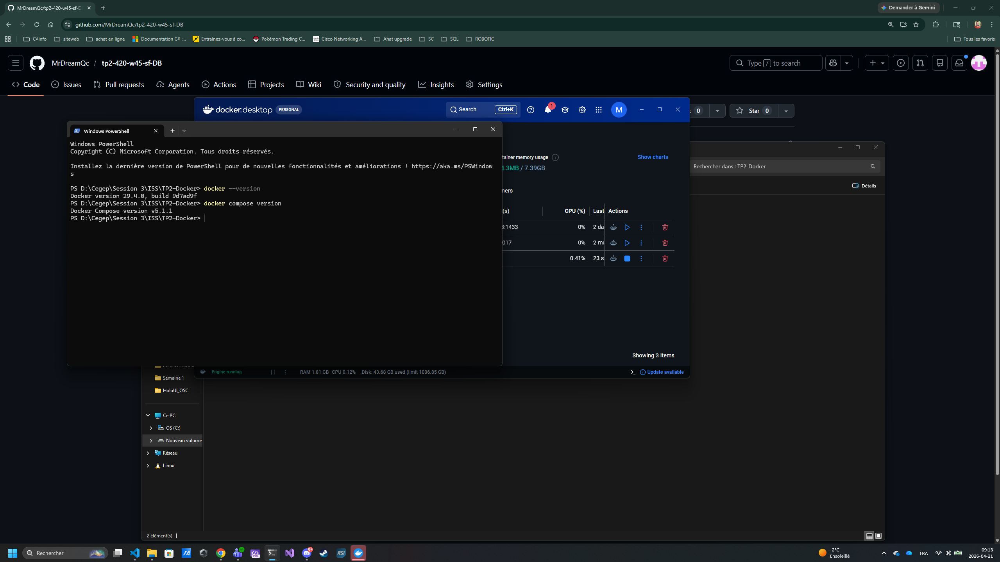
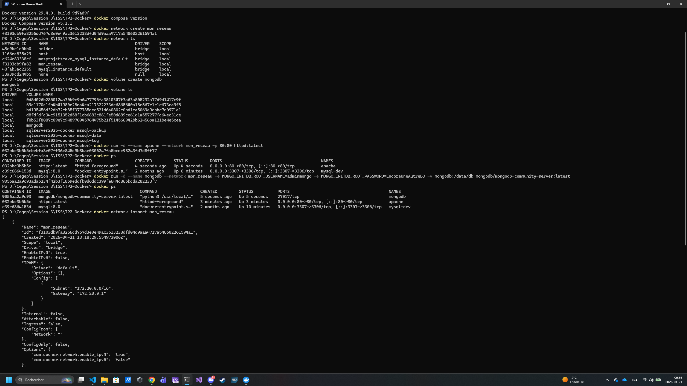

# TP2 - 420-w45-SF-DB

## Nom
Dany Baillargeon

## Date
21-04-2026

## Description du projet
Travail pratique sur Docker : céation de conteneurs, réseau, volumes et image personnalisée.

## Section 1 - étape 1

## Section 1 - étape 2
docker compose version
docker network create mon_reseau
docker network ls
docker volume create mongodb
docker volume ls
docker run -d --name apache --network mon_reseau -p 80:80 httpd:latest
docker run -d --name mongodb --network mon_reseau - e MONGO_INITDB_ROOT_USERNAME=adminmongo -e MONGO_INITDB_ROOT_PASSWORD=EncoreUneAutreBD -v mongodb:/data/db mongodb/mongodb-community-server:latest
docker ps
docker network inspect mon_reseau
docker logs apache

