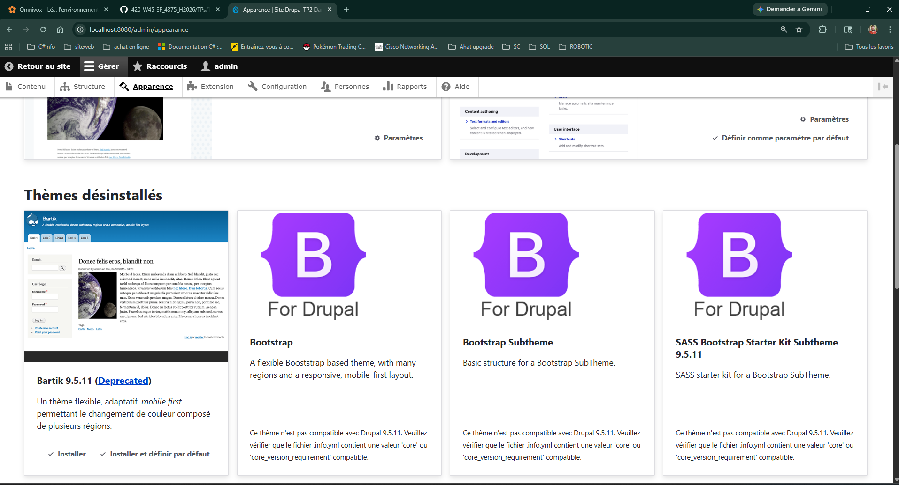
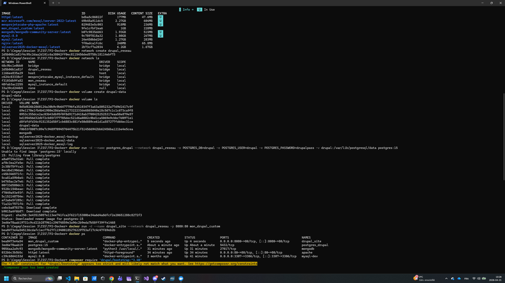

# mon_drupal

## Description
Cette section présente la création d'une image personnalisée Drupal basée sur Drupal 9, avec ajout du thème Bootstrap et utilisation de PostgreSQL.

---

## Vérification du thème Bootstrap

Le thème Bootstrap 3 est bien présent dans la section Apparence de Drupal.

Cependant, un message indique qu'il n'est pas compatible avec la version Drupal 9.5.11 utilisée.

Cela confirme que :
le Dockerfile a correctement cloné le thème
le thème est bien détecté par Drupal




---

## Commandes utilisées
```powershell
docker build -t mon_drupal_custom ./mon_drupal/drupal
docker images
docker network create drupal_reseau
docker network ls
docker volume create drupal-data
docker volume ls
docker run -d --name postgres_drupal --network drupal_reseau -e POSTGRES_DB=drupal -e POSTGRES_USER=drupal -e POSTGRES_PASSWORD=drupalpass -v drupal-data:/var/lib/postgresql/data postgres:15
docker run -d --name drupal_site --network drupal_reseau -p 8080:80 mon_drupal_custom
docker ps
```